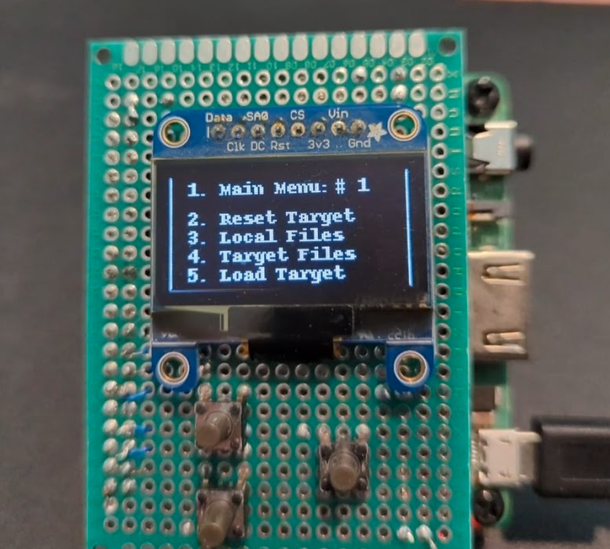

# uploader
## Battery operated device used to upload MicroPython programs and files to a target in the field.

The UpLoader is specifically designed to load MicroPython programs onto small devices where
dragging a PC or laptop would be a bit difficult. Designed to run mpfshell, a program used
by Thonny or just in a CLI, the UpLoader has a small SSD1306 display and holds programs to
upload to targets in the field.

mpfshell runs in a non-interactive (or REPL) mode and its commands are perfect for use on
a larger PC or laptop. mpfshell is not available on small devices like ESP32s or RP2040s.
The smallest format to run mfpshell is a Raspberry Pi.

The current protoytpe shown here is a HAT on a Raspberry Pi 3 A+. 

